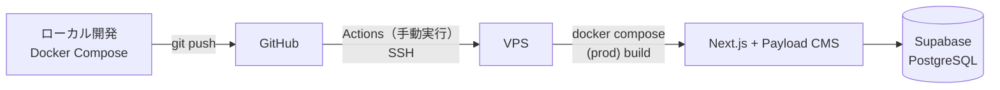

# Sho Sakurai Portfolio

Next.js（App Router）× Payload CMS で構築した、桜井 翔のポートフォリオサイトです。

**公開URL**: https://shou0831.com/

トップページ全体を「桜井 翔という"製品"の仕様書（スペックシート）」に見立て、実績（WORKS）・スキル・お問い合わせまでを1ページに構成しています。人柄・マインドは「取扱説明書」風の特設ページ（`/manual`）として地続きの世界観で見せます。実績とスキルは Payload CMS で構造化し、コードを触らずに更新できます。

## 見どころ

採用担当・エンジニアの方に見ていただきたいポイントです。

- **CMS のスキーマとフロントを型でつなぐ構成** — Payload のコレクション定義から TypeScript の型（`src/payload-types.ts`）を自動生成し、フロントは生成型だけを import します。データ構造の変更は型エラーとして検出されます。公開ページは Server Component から Payload Local API を直接呼び、公開用の API レイヤーを別途持ちません。
- **ケーススタディをデータ構造から設計** — 実績（`Projects`）は固定の4章ではなく、任意順の章（`caseSections`: PROBLEM / DECISION / ARCHITECTURE / MIGRATION / STATUS など）を持てるスキーマにしています。開発中／本番稼働中といった状態（`status`）、案件種別（`workType`）、案件同士の関連（`relatedProjects`）も CMS から管理し、開発中の案件を完成品に見せない表示制御をデータ側で行います。
- **演出は宣言的な仕組みに** — スクロール演出（フェード・パララックス）は client コンポーネントを1つ（`components/UI/ScrollFX`）だけ置き、各セクションは Server Component のまま `data-reveal` / `data-parallax` 属性を付けるだけで演出が乗ります。`prefers-reduced-motion` 指定時は全演出を無効化します。
- **見た目と両立するアクセシビリティ** — スキル説明はホバーだけでなくキーボードフォーカスでも表示し、`aria-describedby` で紐付け。装飾アイコンは `alt=""`、SP はモーダル表示で Escape・背景タップで閉じられます。

## アーキテクチャ



- **フレームワーク**: Next.js 16（App Router・Turbopack）+ React 19 + TypeScript（`strict: true`）
- **CMS**: Payload CMS 3.x（DB アダプタ: `@payloadcms/db-postgres`）。管理画面は `/admin`
- **DB**: Supabase の PostgreSQL（直接接続）。無料プランの自動休止は GitHub Actions の定期ジョブ（`keepalive.yml`）で防止
- **スタイル**: SCSS Modules。ブレークポイント・書体・配色は `_variables.scss` / `_mixins.scss` で一元管理
- **フォント**: 日本語 = Zen Kaku Gothic New / 見出し英字 = Fraunces / ラベル・データ英字（等幅）= IBM Plex Mono
- **アニメーション**: GSAP（`@gsap/react` の `useGSAP` + `ScrollTrigger`）
- **メール送信**: nodemailer（お問い合わせフォーム → `/api/contact`）
- **アクセス解析**: Google Analytics 4（本番ビルドのみ有効）
- **ランタイム / パッケージ管理**: Node.js 24 / pnpm

## データモデル

| コレクション | 役割 |
|---|---|
| `Projects` | 実績。ケーススタディの章（`caseSections`）、状態（`status`）、案件種別（`workType`）、代表案件フラグ（`isFeatured`）、関連案件（`relatedProjects`）、使用スキル（`skills`・Skills逆引き用）、担当範囲・使用技術・制作時期を持つ |
| `ProjectScopes` | 担当範囲のマスタ（要件定義／基本設計／実装 など） |
| `Skills` / `SkillCategories` | スキルと分類（frontend / backend / tools）。得意・学習中のバッジ管理 |
| `Tags` | About の KEYWORDS |
| `Media` / `Users` | アップロード画像・管理ユーザー |

一覧と詳細の並び順・表示ラベルは `src/lib/projects.ts` に集約し、WORKS 一覧と詳細ページの PREV / NEXT が食い違わないようにしています。

## 品質

- **E2E テスト（Playwright）**: `tests/e2e/` に主要導線の回帰テストを実装しています — トップの表示（ファーストビュー・Skills・WORKS）、一覧 → 詳細 → 一覧へ戻る回遊、種別の絞り込み、存在しない実績IDの404、`/manual` への導線。`pnpm test:e2e` で実行（開発サーバー起動中はそれを再利用）
- **型チェック**: `pnpm exec tsc --noEmit`（strict）
- **Lint**: `pnpm lint`（`next/core-web-vitals` + `next/typescript`）
- **フォーマット**: Prettier（`semi: false` / `singleQuote` / `trailingComma: all`）

## デプロイ

GitHub Actions の手動実行ワークフロー（`deploy.yml`）で行います: Actions から実行 → VPS へ SSH → `git fetch` + `git reset --hard origin/main` → `docker compose -f docker-compose.prod.yml up -d --build`。

アップロード画像（`/media`）はホスト側ボリュームで永続化し、ローカルへは `sync-media` サービス（rsync）で同期します。本番 DB（Supabase）はテーブル追加時に RLS の有効化 SQL を再実行する運用です（詳細は [AGENTS.md](AGENTS.md)）。

## ローカル開発

```bash
git clone <repository-url>
cd portfolio
touch .env             # DATABASE_URL / PAYLOAD_SECRET などを設定（値は管理者に確認）
docker compose up      # http://localhost:3000（-d でバックグラウンド）
```

初回アクセス時に `/admin` で管理者ユーザーの作成画面が表示されます。

GA4 を使う場合は `.env` に追加します（任意・未設定でも動作します）。

```env
# 本番ビルドでのみ計測が有効になる（開発では送信しない）
NEXT_PUBLIC_GA_ID=G-XXXXXXXXXX
```

### 主なコマンド（コンテナ内で実行）

| コマンド | 説明 |
|---|---|
| `docker compose exec app pnpm generate:types` | Payload の型定義を生成（スキーマ変更後は必須） |
| `docker compose exec app pnpm generate:importmap` | Payload の ImportMap を生成 |
| `docker compose exec app pnpm lint` | ESLint でコードチェック |
| `docker compose exec app pnpm exec tsc --noEmit` | 型チェック |
| `pnpm test:e2e` | Playwright の E2E テスト（ホスト側で実行。初回のみ `npx playwright install chromium`） |

※ コンテナが起動していない場合は `docker compose run --rm app pnpm <script>` で実行できます。

### media を VPS から同期する

```bash
docker compose --profile sync run --rm sync-media
```

- `vps` は `~/.ssh/config` に定義した Host 名を使います。SSH 鍵は `${HOME}/.ssh` をコンテナへ read-only でマウントします。
- rsync が同期するのは実ファイルのみです。DB のメディアレコードは同期しないため、ローカル DB と実ファイルがずれると画像が壊れて見えることがあります。

## ディレクトリ構成

```
src/
├── app/
│   ├── (frontend)/   # 公開ページ（トップ / works/[id] / manual / 404）
│   └── (payload)/    # Payload 管理画面・API
├── collections/      # Payload コレクション定義
├── lib/              # 画面をまたぐ共有ロジック（projects.ts）
├── components/       # Layout / Sections / Torisetsu / UI
├── payload.config.ts # Payload メイン設定
└── payload-types.ts  # 自動生成型（手で編集しない）
tests/e2e/            # Playwright の E2E テスト
```

## 今後の改善

- OG 画像の用意（現在は `twitter:card: summary`）
- 技術（Skills）での WORKS 絞り込み

## 詰まった時の対処（Docker / pnpm）

`sharp` のロード失敗や依存展開エラーが出るときは、依存が壊れている可能性が高いです。以下を順に実行してください。

```bash
docker compose down -v --remove-orphans
docker volume prune -f
docker builder prune -f
rm -rf node_modules .next
docker compose up --build
```

よくある症状: `Failed to load external module sharp` / `TAR_ENTRY_ERROR ENOENT` / `Cannot find module '../server/lib/start-server'` / `Next.js package not found`

- コンテナイメージは `bookworm-slim`（glibc）を使うと `sharp` で詰まりにくいです。
- 依存導入は `pnpm install --frozen-lockfile`（lockfile 厳守）で行うと再現性が高くなります。
